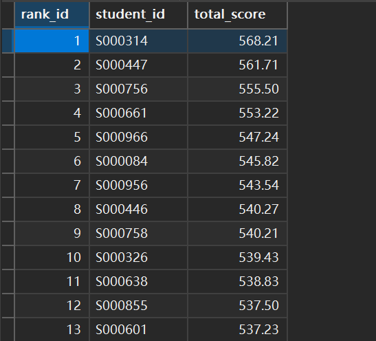

# 需求分析

## 一、 核心业务需求分析

### 1.  班级与选科管理需求

该模块是教务系统的核心业务之一，核心支撑高二选科分班流程，需满足“全组合独立开班、阈值校验、自主调选”的业务规则。

#### 1.1  基础课程与选科规则

-  课程范围：高中共计9门核心课程，分为3门主科（语文、数学、英语）和6门选科（物理、化学、生物、政治、历史、地理）。
-  高一阶段：全体学生必修9门课程，信息需完整留存，作为学生历史记录。
-  高二阶段：实行选科分班制度，核心规则为「3门主科必选 + 物理/历史二选一 + 政地生化四选二」，最终形成固定选科组合，以该组合为单位独立开班。
-  选科组合范围：共计12种合法选科组合（2种二选一结果 × 6种四选二结果），每种组合对应一个独立的高二固定选科班级。

#### 1.2  开班阈值与选课调整

-  开班阈值：为每种高二选科组合预设最低开班人数阈值，低于该阈值的组合不开班。
-  人数统计：选课期间需实时统计各选科组合的报名学生人数，生成选课人数统计表。
-  调选机制：对于人数低于开班阈值的选科组合，该组合下的学生需重新选择合法选科组合；同时教务主任具备手动调整学生选科组合的权限，保障分班工作顺利推进。

#### 1.3  班级关联与数据留存

-  高一：完整存储行政班的基础信息、学生名单、班主任等数据，高二分班后不删除，作为学生的高一就读历史记录留存。
-  高二/高三：存储选科组合、班主任等信息，建立与学生高一行政班的关联关系，支持追溯学生班级变迁记录。
-  班级类型区分：明确区分“行政班”（高一）与“选科班”（高二/高三），保障业务逻辑的清晰性。

### 2.  权限管理需求

基于「角色-权限」模型，构建清晰的权限体系，满足不同用户的业务操作需求，同时保障数据访问安全，支持角色兼任与权限继承。

#### 2.1  角色定义与核心权限

系统预设5类核心角色，各角色权限边界清晰，具体如下表所示：

| 角色名称 | 核心权限                    | 权限细节补充                                                 |
| -------- | --------------------------- | ------------------------------------------------------------ |
| 学生     | 个人数据查看权              | 可查看本人历次考试的原始分、赋分成绩（如有）。               |
| 班主任   | 班级数据查看权              | 可查看所带班级全体学生的历次考试成绩（所有科目）。           |
| 科任老师 | 授课数据查看权              | 可查看/修改所教课程所有学生的历次考试成绩（仅该门课程）。    |
| 教务主任 | 分班管理+全校数据查看权     | 1.  发起/结束高二学生选课操作；2.  查看各选科组合选课人数统计报表；3.  手动调整人数不足的选科组合（学生调选）；4.  查看全校学生、班级、教职工信息等所有数据。 |
| 校长     | 教职工管理+继承教务主任权限 | 1.  自动继承教务主任的所有权限；2.  能够修改除校长外的教职工的职位/是否离职/所教课程属性 |

#### 2.2  角色兼任规则

-  允许兼任：班主任与科任老师可同时兼任。
-  禁止兼任：校长、教务主任与其他角色不可兼任，避免权限过度集中与业务流程混乱。

#### 2.3  权限继承规则

-  单向继承：仅支持上级角色继承下级角色的权限，核心为「校长自动继承教务主任的所有权限」，无需额外配置。
-  无反向继承：下级角色不继承上级角色的权限（如班主任不继承教务主任权限、教务主任不继承校长权限）。
-  基础角色无继承：学生、班主任、科任老师之间无任何权限继承关系，权限边界相互隔离。

### 3.  考试与成绩管理需求

实现考试信息的分类管理、学生成绩的完整存储、市统考赋分计算，满足高中各类考试的成绩统计与分析需求。

#### 3.1  考试信息管理

-  考试分类：支持标记考试类型，包括月考、期中、期末、市统考等，允许一个考试关联多个类型（如“高二上学期第一次月考+市统考”）。
-  考试属性区分：仅“市统考”类型的考试，需记录各单科的「市排名」与「有效参考总人数」；非市统考考试无需记录这两项数据。
-  考试基础信息：需存储考试编号、考试名称、考试时间、备注等基础信息，保障考试数据的完整性。

#### 3.2  成绩存储规则

-  存储维度：每科成绩需同时存储「原始分」与「赋分成绩」，二者独立留存，不可相互覆盖。
-  赋分触发条件：仅满足“考试类型为市统考”且“科目为政史地生四门选科”两个条件时，才生成并存储赋分成绩；其他场景仅存储原始分。
-  成绩唯一性：确保一个学生、一门课程、一次考试仅对应一条成绩记录，避免重复数据。

#### 3.3  赋分与排名规则

-  赋分规则：采用固定不可修改的赋分规则，基于学生单科市排名与有效参考总人数计算赋分成绩。
-  排名维度：市排名按「单科」独立统计，不跨科目、不跨班级合并排名，每个科目单独生成排名榜单。
-  数据关联：赋分成绩需与对应的原始分、市排名、有效参考人数关联存储，支持追溯赋分计算依据。

### 4.  基础数据管理需求

基础数据是系统运行的核心支撑，需满足完整存储、有效关联的需求，包括学生表、教职工表、课程表三大核心基础表。

#### 4.1  学生表需求

-  存储学生基础信息：学号（唯一标识）、姓名、性别、出生日期（可选）、当前年级、当前班级、高一行政班等。
-  数据关联：与班级表、选课记录表、考试成绩表建立有效关联，支持追溯学生的班级变迁、选科结果、成绩记录。
-  数据留存：学生信息一旦录入，不可随意删除，仅支持修改部分非核心信息（如联系方式），保障学生数据的连续性。

#### 4.2  教职工表需求

-  存储教职工基础信息：工号（唯一标识）、姓名、性别、职称、所授课程、是否离职、录入时间。
-  数据关联：与角色表、班级表建立有效关联，支持追溯教职工的角色分配、所带班级、所教课程。
-  状态管理：支持修改教职工「是否离职」状态，离职教职工信息留存，不可删除，保障教职工数据的完整性。

#### 4.3  课程表需求

-  存储课程基础信息：课程编号（唯一标识）、课程名称、课程类型（主科/选科）、是否参与赋分（仅政史地生为是）等。
-  数据关联：与考试成绩表、选课记录表建立有效关联，支持追溯课程的学生成绩、选科组合关联。
-  数据固定：高中9门核心课程信息固定录入，不可随意新增、删除，仅支持修改部分备注信息。

## 三、 数据需求分析

### 1.  核心实体识别

系统核心实体包括：学生、教职工、班级、课程、角色、选课记录、考试信息、考试成绩、账号。

### 2.  实体间核心关系

1.  学生与班级：多对一（一个班级包含多个学生，一个学生同一时间仅属于一个班级）
2.  教职工与角色：多对多（一个教职工可对应多个角色，一个角色可对应多个教职工，通过角色关联表实现）。
3.  教职工与班级：一对一（一个教职工只可担任一个班级班主任，一个班级仅对应一个班主任）。
4.  教职工与课程：多对多（一个教职工可教授多门课程，一门课程可由多个教职工教授）。
5.  学生与选课记录：一对一（一个高二学生仅对应一条选科记录）。
6.  考试与成绩：一对多（一次考试包含多条学生单科成绩记录）。
7.  课程与成绩：一对多（一门课程包含多条学生历次考试成绩记录）。

### 3.  数据完整性要求

1.  实体唯一性：每个核心实体需有唯一标识（如学生学号、教职工工号、成绩编号），避免数据重复。
2.  关联有效性：外键关联需确保引用的数据存在（如班主任工号必须对应教职工表中的有效工号），防止无效数据。
3.  非空约束：核心字段（如姓名、学号、课程名称）不可为空，保障数据的完整性。
4.  数据一致性：关联数据更新时需联动同步（如教职工工号修改，班级表中的班主任工号需同步更新），避免数据冲突。


# 概念设计(E-R图)


# 关系模型
# 广州高中教务系统数据库表结构（基本表形式，对应调整后创建顺序）
## 1.  账号密码表（account）
| 属性名 | 数据类型 | 约束 | 说明 |
| ---- | ---- | ---- | ---- |
| person_id | VARCHAR(20) | 主键 | 对应用户ID，关联学生学号或教职工工号 |
| password | VARCHAR(20) | 非空 | 登录密码 |

## 2.  角色表（role）
| 属性名 | 数据类型 | 约束 | 说明 |
| ---- | ---- | ---- | ---- |
| role_id | VARCHAR(20) | 主键 | 角色编号，唯一标识系统角色 |
| role_name | ENUM('学生', '班主任', '科任老师', '教务主任', '校长') | 非空 | 角色名称，预设系统核心角色 |
| role_desc | VARCHAR(200) | 可选 | 角色描述，说明各角色核心权限范围 |

## 3.  课程表（course）
| 属性名 | 数据类型 | 约束 | 说明 |
| ---- | ---- | ---- | ---- |
| course_id | VARCHAR(20) | 主键 | 课程编号，唯一标识一门课程 |
| course_name | VARCHAR(50) | 非空 | 课程名称（如语文、数学、物理） |
| course_type | ENUM('主科', '主选科', '副选科') | 非空 | 课程类型，区分主科（语数外）与选科 |
| is_score_convert | ENUM('是', '否') | 非空 | 仅政地生化为“是” |

## 4.  教职工表（staff）
| 属性名 | 数据类型 | 约束 | 说明 |
| ---- | ---- | ---- | ---- |
| staff_id | VARCHAR(20) | 主键, 外键 | 教职工工号，唯一标识一名教职工 |
| staff_name | VARCHAR(50) | 非空 | 教职工姓名 |
| gender | ENUM('男', '女') | 非空 | 教职工性别 |
| position | VARCHAR(50) | 非空 | 教职工职称（如一级教师、高级教师） |
| is_leave | ENUM('是', '否') | 非空，默认“否” | 教职工离职状态，默认在职 |
| create_time | DATETIME | 非空，默认当前时间戳 | 教职工信息录入系统时间 |

## 5.  班级表（class）
| 属性名 | 数据类型 | 约束 | 说明 |
| ---- | ---- | ---- | ---- |
| class_id | VARCHAR(20) | 主键 | 班级编号，唯一标识一个班级 |
| class_name | VARCHAR(50) | 非空 | 班级名称（如高一（1）班、高二物理政治地理班） |
| grade | INT | 非空 | 年级，1（高一）、2（高二）、3（高三） |
| subject_combination | VARCHAR(100) | 可选 | 选科组合编码，“物理/历史+政地生化四选二”的所有合法组合 |
| head_teacher_id | VARCHAR(20) | 外键（关联staff.staff_id） | 班主任工号，关联教职工表，确保班主任合法性 |
| current_student_num | INT | 非空，默认0 | 当前班级在册学生人数 |
| create_time | VARCHAR(20) | 非空，年份 | 班级对应的学生入学年份(如'2023') |

## 6.  学生表（student）
| 属性名 | 数据类型 | 约束 | 说明 |
| ---- | ---- | ---- | ---- |
| student_id | VARCHAR(20) | 主键, 外键 | 学号，唯一标识一名学生 |
| student_name | VARCHAR(50) | 非空 | 学生姓名 |
| gender | ENUM('男', '女') | 非空 | 学生性别 |
| grade | INT | 非空 | 学生当前年级，1（高一）、2（高二）、3（高三） |
| class_id | VARCHAR(20) | 外键（关联class.class_id）、非空 | 学生当前所在班级编号 |
| high1_class_id | VARCHAR(20) | 外键（关联class.class_id）、非空 | 学生高一就读的行政班编号，留存历史记录 |
| create_time | DATETIME | 非空，默认当前时间戳 | 学生信息录入系统时间 |

## 7.  角色关联表（account_role）
| 属性名 | 数据类型 | 约束 | 说明 |
| ---- | ---- | ---- | ---- |
| id | INT | 主键，自增 | 关联记录ID，唯一标识一条账号-角色关联记录 |
| account_id | VARCHAR(20) | 外键（关联account.person_id）、非空 | 系统账号，关联账号密码表 |
| role_id | VARCHAR(20) | 外键（关联role.role_id）、非空 | 角色编号，关联角色表 |
| - | - | 复合唯一键（account_id + role_id） | 防止同一账号重复分配同一角色，支持班主任与科任老师合法兼任 |

## 8.  选课记录表（student_course_choose）
| 属性名 | 数据类型 | 约束 | 说明 |
| ---- | ---- | ---- | ---- |
| id | INT | 主键，自增 | 选课记录ID，唯一标识一条学生选科记录 |
| student_id | VARCHAR(20) | 外键（关联student.student_id）、非空 | 学号，关联学生表 |
| main_course | VARCHAR(100) | 非空，默认“语文,数学,英语” | 主科组合，固定为三门主科，无需修改 |
| two_choose_one | ENUM('物理', '历史') | 非空 | 物理/历史二选一的选课结果 |
| four_choose_two | VARCHAR(50) | 非空 | 政地生化四选二的选课结果（如“政治,地理”） |
| class_id | VARCHAR(20) | 外键（关联class.class_id）、可选 | 学生最终分配的高二选科班编号 |
| choose_status | ENUM('待确认', '已确认', '需调整', '处理中', '已分班') | 非空，默认“待确认” | 选课流程状态，标记是否需要重新选科 |
| choose_time | DATETIME | 非空，默认当前时间戳 | 学生提交选课志愿的时间 |
| - | - | 唯一键（student_id） | 确保一个学生仅对应一条高二选科记录 |

## 9.  考试信息表（exam）
| 属性名 | 数据类型 | 约束 | 说明 |
| ---- | ---- | ---- | ---- |
| exam_id | VARCHAR(20) | 主键 | 考试编号，唯一标识一场考试 |
| exam_name | VARCHAR(100) | 非空 | 考试名称（如“2025-2026学年高二上学期月考”） |
| exam_time | DATETIME | 非空 | 考试举办时间 |
| valid_exam_num | INT | 可选 | 该科目有效参考总人数 |
| remark | VARCHAR(200) | 可选 | 考试补充说明，如考试范围、组织单位等 |

## 10.  考试成绩表（exam_score）
| 属性名 | 数据类型 | 约束 | 说明 |
| ---- | ---- | ---- | ---- |
| id | INT | 主键，自增 | 成绩记录ID，唯一标识一条学生单科考试成绩 |
| exam_id | VARCHAR(20) | 外键（关联exam.exam_id）、非空 | 考试编号，关联考试信息表 |
| student_id | VARCHAR(20) | 外键（关联student.student_id）、非空 | 学号，关联学生表 |
| course_id | VARCHAR(20) | 外键（关联course.course_id）、非空 | 课程编号，关联课程表 |
| original_score | DECIMAL(5,2) | 非空 | 学生该科目的原始考试得分 |
| convert_score | DECIMAL(5,2) | 可选 | 赋分成绩，仅当考试科目为政地生化时有值 |
| course_rank | INT | 可选 | 单科排名 |
| - | - | 复合唯一键（exam_id + student_id + course_id） | 确保一个学生一门课程一次考试仅有一条成绩记录 |


# 功能实现

## 一. 班级与选课管理模块

###  1. 根据学生选课自动分班功能

#### 实现效果

根据学生选课情况，系统能够自动完成高二选科分班，具体效果如下：

- **人数控制**：尽可能使每个分班的人数控制在40~50人之间，确保班级规模合理
- **开班阈值**：对于选课人数少于30人的选科组合，系统将其标记为"需调整"，暂不分班，避免小班教学资源浪费
- **智能分班**：对于人数在40人以上的选科组合，自动计算最优分班方案，生成多个班级并将学生合理分配
- **状态管理**：完整跟踪学生选课状态变化（待确认→已确认→处理中→已分班），确保分班过程可控
- **数据关联**：分班后自动更新学生表中的班级信息，建立学生与新班级的关联关系

#### 实现原理

自动分班功能基于MySQL存储过程实现，主要包括以下核心算法：

1. **数据预处理**：统计各选科组合的选课人数，筛选出人数达到开班阈值（≥40人）的组合
2. **分班算法**：采用优化算法计算最优班级数量，目标是使每个班级人数尽可能接近40~50人的理想区间
   - 首先尝试寻找完美解：班级数在[min_g, max_g]范围内，且所有班级人数都在[40, 50]区间
   - 若无完美解，则采用违规分最低的方案：计算各种分班方案的违规分（超出[40, 50]区间的惩罚分数），选择违规分最低的方案
3. **学生分配**：按照计算出的班级数量和每个班的人数，将学生依次分配到新创建的班级中
4. **状态更新**：同步更新学生信息表和选课记录表，确保数据一致性

#### 调用示例

```sql
-- 1. 首先将选课状态调整为"已确认"（假设选课截止）
UPDATE student_course_choose SET choose_status = '已确认', class_id = NULL;

-- 2. 处理人数不足的选科组合（<40人），标记为"需调整"
CALL HandleInsufficientCombination();

-- 3. 手动调整学生选课（当需要人工干预时）
CALL AdjustStudentCourseSelection('S000001', '历史', '政治,生物');

-- 4. 执行自动分班
CALL CheckSubjectCombinationThreshold();

-- 5. 查看分班统计结果
CALL GroupStatistics();
```

#### 实现重难点

1. **分班算法优化**：如何在满足[40, 50]人数区间约束的前提下，寻找最优分班方案是一个复杂的优化问题，需要考虑多种边界情况和性能优化。在代码实现中，通过创建临时表`temp_process_list`存储符合条件的选科组合，使用数学公式计算最优班级数，包括：
   - 完美解搜索：`min_g = CEIL(v_student_count / 50)`，`max_g = FLOOR(v_student_count / 40)`
   - 违规分最低方案：计算`v_penalty`惩罚分数，选择违规分最低的分班方案
   - 大班小班人数控制：`v_size_large = base_size + 1`，`v_size_small = base_size`，确保班级规模均衡

2. **并发控制**：在分班过程中需要处理可能的并发问题，确保多选科组合同时分班时数据一致性，使用事务控制和状态锁定机制。通过创建临时表避免死锁问题，在分班过程中使用`choose_status = '处理中'`状态锁定选课记录，并使用`LIMIT`子句控制学生分配数量，防止数据冲突。

3. **数据一致性**：分班涉及多个表的数据更新（选课记录表、学生表、班级表），需要保证所有数据同步更新，使用事务确保ACID特性。代码中通过以下方式保证一致性：
   - 使用`START TRANSACTION`和`COMMIT`事务控制
   - 使用`INNER JOIN`进行关联更新
   - 在更新选课记录后同步更新学生表中的班级信息

4. **性能优化**：对于大量学生数据的分班操作，优化SQL查询和更新语句，避免全表扫描和锁等待问题。通过以下方式实现性能优化：
   - 使用临时表缓存中间结果，减少对原始表的查询次数
   - 使用索引加速关联查询
   - 通过`LIMIT`分批处理大量学生数据
   - 合理使用`WHERE`条件过滤数据，避免不必要的数据扫描

5. **异常处理**：需要处理各种异常情况，如分班过程中数据变化、系统故障等，确保分班过程的可靠性和可恢复性。通过声明`EXIT HANDLER`处理SQL异常，使用事务回滚机制保证数据完整性。


## 二. 考试与成绩管理模块

### 1. 成绩排名生成功能

#### 实现效果
- 自动为指定考试和科目的学生成绩进行排名计算
- 支持按考试ID和课程ID进行筛选，可对特定考试或科目进行排名
- 使用RANK()函数处理同分同名次情况，确保排名的准确性
- 支持批量处理，可通过通配符对所有考试或科目进行排名更新

#### 实现原理
排名功能基于MySQL窗口函数实现：
- 使用 `RANK() OVER (PARTITION BY exam_id, course_id ORDER BY original_score DESC)` 对每个考试和科目的学生按原始分降序排名
- 通过子查询获取排名结果，再与原表进行JOIN更新
- 使用参数化查询，支持灵活的筛选条件
- 支持批量处理，可通过通配符对所有考试或科目进行排名更新；基于 `LIKE` 的**正则匹配**特性和`%`来匹配任意`exam_id`或`course_id`

#### 调用示例
```sql
-- 更新特定考试和科目的排名
CALL UpdateExamRank('E2026011517423001', 'C008');

-- 更新所有考试的特定科目排名
CALL UpdateExamRank('%', 'C008');

-- 更新特定考试的所有科目排名
CALL UpdateExamRank('E2026011517423001', '%');

-- 更新所有考试和所有科目的排名
CALL UpdateExamRank('%', '%');
```

#### 实现重难点
1. **窗口函数使用**：需要正确使用PARTITION BY和ORDER BY子句，确保在每个考试-科目组合内进行独立排名
2. **性能优化**：对大量学生成绩进行排名可能影响性能，需考虑索引优化和查询效率。具体优化措施包括：
   - 在`exam_id`、`course_id`建立复合索引，以加速`PARTITION BY`操作
   - 在`original_score`字段上建立单独索引，以加速`ORDER BY`操作
   - 利用MySQL的索引下推优化，减少不必要的数据扫描
   - 通过参数化查询和预编译语句提高查询执行效率
   - 采用子查询和JOIN的方式，避免重复计算，提高整体查询性能
3. **同分同名处理**：使用RANK()而非ROW_NUMBER()，确保**相同分数获得相同排名**，并且跳过下一个排名从该相同排名值+x开始。例如，如果有3名学生并列第5名，则下一个学生的排名为第8名（5+3=8），而不是第6名。


### 2. 自动赋分功能

#### 赋分制度概述：

- 对“政地生化”采取 “赋分制”，考生的成绩从高到低排序，根据人数比例划为 “A-E” 5个等级，各等级人数所占比例分别为 15%、35%、35%、13% 和 2%。
- 赋分区间：每个等级对应的分数区间如下：

​							A等级：100～86分

​							B等级：85～71分

​							C等级：70～56分

​							D等级：55～41分

​							E等级：40～30分

#### 赋分计算方式：

实际实现采用基于排名百分位的等级赋分制：

1. 首先根据学生原始成绩在考试中的排名确定所属等级
2. 然后在等级内根据排名位置计算具体分数
3. 使用RANK()函数处理同分同名次情况

计算公式：

- A等级(前15%)：$T = 100 - \frac{(排名百分位 - 0)}{15} \times 14$
- B等级(16%-50%)：$T = 85 - \frac{(排名百分位 - 15)}{35} \times 14$
- C等级(51%-85%)：$T = 70 - \frac{(排名百分位 - 50)}{35} \times 14$
- D等级(86%-98%)：$T = 55 - \frac{(排名百分位 - 85)}{13} \times 14$
- E等级(后2%)：$T = 40 - \frac{(排名百分位 - 98)}{2} \times 10$

其中，排名百分位 = $\frac{学生排名 \times 100.0}{总人数}$

#### 实现效果
- 自动为需要赋分的科目（政史地生）计算赋分成绩
- 赋分结果精确到小数点后两位，确保计算精度
- 赋分成绩范围严格控制在30-100分之间，符合高考赋分制度要求

#### 实现重难点
1. **赋分精度控制**：通过ROUND函数确保赋分结果的精度，避免浮点数计算误差
2. **条件校验**：检查课程是否参与赋分(is_score_convert)，避免非赋分课程被错误计算
3. **边界值处理**：使用GREATEST和LEAST函数确保赋分成绩在30-100分的合理范围内
4. **排名准确性**：依赖于排名生成功能的准确性，必须先完成排名再进行赋分

### 3. 修改成绩录入日志功能

当科任老师修改成绩后，考试成绩表(exam_score)上的触发器会自动判断修改前后成绩是否一致，如果不一致则会将成绩基础信息、新旧成绩以及修改时间录入日志，用于最终人为更改成绩的**敏感操作**。


## 三. 权限管理模块

相关函数在**sql\procedures\权限管理.py**文件中，核心是用python获取用户角色和相关权限，判断以下操作是否合法

关键函数：get_user_role_and_info，用于获取用户角色以及班级和课程id(如果有对应权限)

### 1. 查询成绩权限

向**query_score**函数提供目标学生的id和课程id，进行权限判断：

- 学生只能查看自己的成绩
- 获取目标学生班级，班主任只能查看自己班内学生成绩
- 科任老师只能查看所授课程的学生成绩
- 校长和教务主任可以看所有学生的成绩

权限判断通过才会返回目标的查询数据

### 2. 修改成绩权限

向**update_score**函数提供目标成绩id和新成绩，进行权限判断：

- 只有课程栏有有效课程的科任老师才能修改成绩
- 科任老师只能修改自己所教课程的成绩

权限判断通过才能完成修改成绩操作

### 3. 修改教职工信息权限

向**update_staff_info_api**函数提供目标职工id和修改数据，进行权限判断：

- 只有校长才能修改教职工表
- 校长只能修改职位是”校长“以外的教职工数据，且只能改职位、所教课程、是否离职这三项属性

权限判断通过才能完成修改教职工信息操作

## 四. 基础数据管理模块

### 班级视图
编写存储过程函数proc_create_class_view，为每个班级生成一个视图，里面有该班级的所有学生id、姓名以及所属班级字段。

具体实现：

1. 用游标选出class_id(班级id)
2. 查询student表中class_id与该班级id匹配的学生，选取其中的学生id、姓名和所属班级字段作为该班的视图
3. 完成所有班级视图的生成并返回结束信息


### 成绩视图
编写存储过程函数proc_create_exam_view，为每一次考试生成一个视图，里面有该次考试的学生id、总成绩以及排名。

具体实现：

1. 用游标选出exam_id(考试id)和exam_name
2. 按学生分组后计算该次考试的所有考生的总成绩并进行排名
   - 总成绩采用”**有赋分计算赋分，无则取原始分**“的规则累加
   - 同分的学生会按照语文—>数学—>英语—>选课的优先级进行比较，分数高的在前，相同则比较下一优先级
3. 完成所有考试视图的生成并返回结束信息


# 功能演示与测试

通过存储函数和存储过程实现自动生成成千上万条数据条模拟数据，验证数据库设计在稍大数据量下的查询性能。

## 创建基本表

利用 `.\sql\基本表定义.sql` 创建数据库 `Database_Design` 的基本表并验证基本表是否创建成功，Powershell 代码为：`get-Content -Encoding UTF8 ".\sql\基本表定义.sql" | & "C:\Program Files\MySQL\MySQL Server 8.0\bin\mysql.exe" -uroot -proot`。
一共有 10 个基本表：分别是：账号密码表 (account)、角色表 (role)、课程表 (course)、教职工表 (staff)、班级表 (class)、学生表 (student)、角色关联表 (account_role)、选课记录表 (student_course_choose)、考试信息表 (exam)、考试成绩表 (exam_score)。
同时在创建基本表达同时会初始化课程表 (course)和角色表 (role)的值，因为它们的值是固定的。
![[_res/Shoot_2026-01-15_20-31-10.png|450]]

## 用户账号和班级创建

执行 `test/用户插入.sql` 文件中的SQL语句，成功插入了以下数据：
1. 账号表(account)：共1043条记录
    - 学生：1000名（学号S000001-S1000000）
    - 教职工：43名（工号T000001-T000043）
2. 教职工表(staff)：共43条记录
    - 校长：1名（朱娜）
    - 教务主任：2名
    - 教师：40名（其中20名班主任+科任老师，20名仅科任老师）
3. 学生表(student)：共1000条记录
    - 高一学生，分布在20个行政班中（每班50人）
4. 班级表(class)：共20条记录
    - 高一班级（C101-C120），每班分配了班主任
5. 角色分配情况：
    - 学生角色：1000个
    - 班主任角色：20个
    - 科任老师角色：40个
    - 教务主任角色：2个
    - 校长角色：1个

所有数据均已成功插入并验证，符合预期的学校管理系统数据结构。

1)​ 执行 sql 代码，向用户账号表(account)、教职工表(staff)、学生表(student)和班级表(class)插入数据。
```powershell
Get-Content -Encoding UTF8 "test/用户插入.sql" | & "C:\Program Files\MySQL\MySQL Server 8.0\bin\mysql.exe" --defaults-file="C:\ProgramData\MySQL\MySQL Server 8.0\my.ini" -uroot -proot --default-character-set=utf8mb4 --init-command="SET NAMES utf8mb4;" 
mysql: [Warning] Using a password on the command line interface can be insecure.
```
2)​ 验证4个表是否成功插入数据，并查看每个表的记录数量。
```powershell
& "C:\Program Files\MySQL\MySQL Server 8.0\bin\mysql.exe" --defaults-file="C:\ProgramData\MySQL\MySQL Server 8.0\my.ini" -uroot -proot --default-character-set=utf8mb4 -e "USE Database_Design; SELECT 'account' as table_name, COUNT(*) as count FROM account UNION ALL SELECT 'staff' as table_name, COUNT(*) as count FROM staff UNION ALL SELECT 'student' as table_name, COUNT(*) as count FROM student UNION ALL SELECT 'class' as table_name, COUNT(*) as count FROM class;"
```
一共创建了 **1000 个高一学生**，被平均分到 **20 个班级**；一共创建了 **40 个科任老师**，其中 **20 人兼任班主任**；同时还创建了 **2 个教务主任**和 **1 个校长**，总共 **1043 个账号和 20 个班级**。
![[_res/Shoot_2026-01-15_20-54-29.png|450]]
3)​ 查看账号的角色分配情况。
查看账号的角色分配情况：1000 个学生，20 个班主任，40 个科任老师，2 个教务主任和 1 个校长。
```powershell
& "C:\Program Files\MySQL\MySQL Server 8.0\bin\mysql.exe" --defaults-file="C:\ProgramData\MySQL\MySQL Server 8.0\my.ini" -uroot -proot --default-character-set=utf8mb4 -e "USE Database_Design; SELECT r.role_name, COUNT(ar.role_id) as role_count FROM account_role ar JOIN role r ON ar.role_id = r.role_id GROUP BY r.role_name ORDER BY r.role_name;"
mysql: [Warning] Using a password on the command line interface can be insecure.
```
![[_res/Shoot_2026-01-15_20-50-22.png|450]]
4)​ 分别查看教职工表、学生表和班级表的内容。
```powershell
# 教职工表
 "C:\Program Files\MySQL\MySQL Server 8.0\bin\mysql.exe" --defaults-file="C:\ProgramData\MySQL\MySQL Server 8.0\my.ini" -uroot -proot --default-character-set=utf8mb4 -e "USE Database_Design; SELECT staff_id, staff_name, gender, position, is_leave FROM staff LIMIT 10;"
 # 学生表
 & "C:\Program Files\MySQL\MySQL Server 8.0\bin\mysql.exe" --defaults-file="C:\ProgramData\MySQL\MySQL Server 8.0\my.ini" -uroot -proot --default-character-set=utf8mb4 -e "USE Database_Design; SELECT student_id, student_name, gender, grade, class_id FROM student LIMIT 10;"
 # 班级表
 & "C:\Program Files\MySQL\MySQL Server 8.0\bin\mysql.exe" --defaults-file="C:\ProgramData\MySQL\MySQL Server 8.0\my.ini" -uroot -proot --default-character-set=utf8mb4 -e "USE Database_Design; SELECT class_id, class_name, grade, head_teacher_id, current_student_num FROM class LIMIT 10;"
```
![[_res/Shoot_2026-01-15_20-56-27.png|450]]

## 模拟选课和分班

情景：
- 高一结束了，高一的同学需要提交选课意向到选课记录表 (student_course_choose)。
- 到达截止日期（DDL1）后，系统自动将全员的选课状态中“待确认”切换为“已确认”。
- 系统统计不符合开班条件的选课组合（即选择人数 < 开班阈值 30 的选课组合），由教务主任通知对应的学生调整选课意向，并由教务主任手动修改。
- 确认可以分班后，系统自动根据选课组合的人数拆分班级，并尽量保证班级人数在 [40, 50] 区间内。

1)​ 添加相关存储过程
```powershell
GET-Content -Encoding UTF8 ".\sql\procedures\course_selection.sql" | & "C:\Program Files\MySQL\MySQL Server 8.0\bin\mysql.exe" --defaults-file="C:\ProgramData\MySQL\MySQL Server 8.0\my.ini" -uroot -proot --default-character-set=utf8mb4 --init-command="SET NAMES utf8mb4;"
```
2)​ 使用存储过程模拟 1000 名高一学生选课，其中有 2 个选课组合的人数少于 30 人。
```powershell
Get-Content -Encoding UTF8 "test/选课数据插入.sql" | & "C:\Program Files\MySQL\MySQL Server 8.0\bin\mysql.exe" --defaults-file="C:\ProgramData\MySQL\MySQL Server 8.0\my.ini" -uroot -proot --default-character-set=utf8mb4 --init-command="SET NAMES utf8mb4;"
```
![[_res/Shoot_2026-01-15_20-58-12.png|450]]
3)​ 到达 DDL1，系统自动将全员的选课状态中“待确认”切换为“已确认”。
```powershell
echo "use Database_design; update student_course_choose set choose_status = '已确认', class_id = NULL;" | & "C:\Program Files\MySQL\MySQL Server 8.0\bin\mysql.exe" --defaults-file="C:\ProgramData\MySQL\MySQL Server 8.0\my.ini" -uroot -proot --default-character-set=utf8mb4 --init-command="SET NAMES utf8mb4;"
# 验证
echo "use Database_design;select count(*) from student_course_choose where choose_status = '已确认'" | & "C:\Program Files\MySQL\MySQL Server 8.0\bin\mysql.exe" --defaults-file="C:\ProgramData\MySQL\MySQL Server 8.0\my.ini" -uroot -proot --default-character-set=utf8mb4 --init-command="SET NAMES utf8mb4;"
```
![[_res/Shoot_2026-01-15_21-11-43.png|450]]
4)​ 系统统计不符合开班条件的选课组合（即选择人数 < 开班阈值 30 的选课组合）。
可以看到就是“物理+政治,地理”和“历史+生物,化学”这两个冷门选课组合不满足开班条件，教务主任根据这个表通知对应的学生单独找 TA 修改选课意愿为其他可以开班的选课组合。
```powershell
echo "use Database_design;CALL HandleInsufficientCombination();" | & "C:\Program Files\MySQL\MySQL Server 8.0\bin\mysql.exe" --defaults-file="C:\ProgramData\MySQL\MySQL Server 8.0\my.ini" -uroot -proot --default-character-set=utf8mb4 --init-command="SET NAMES utf8mb4;"
```
![[_res/Shoot_2026-01-15_21-17-18.png|450]]
5)​ 由教务主任通知对应的学生调整选课意向，并由教务主任手动修改。
这里以 4) 查询得到的第一个同学（S000029 朱泽）为例，进行调整；其余同学在本示例中不进行调整。
```powershell
# 调整
echo "use Database_design;CALL AdjustStudentCourseSelection('S000029', '物理', '政治,生物');" | & "C:\Program Files\MySQL\MySQL Server 8.0\bin\mysql.exe" --defaults-file="C:\ProgramData\MySQL\MySQL Server 8.0\my.ini" -uroot -proot --default-character-set=utf8mb4 --init-command="SET NAMES utf8mb4;"
# 验证
echo "use Database_design;select student_id, two_choose_one, four_choose_two from student_course_choose where student_id = 'S000029';" | & "C:\Program Files\MySQL\MySQL Server 8.0\bin\mysql.exe" --defaults-file="C:\ProgramData\MySQL\MySQL Server 8.0\my.ini" -uroot -proot --default-character-set=utf8mb4 --init-command="SET NAMES utf8mb4;"
```
![[_res/Shoot_2026-01-15_21-27-45.png|450]]
6)​ 确认可以分班后，系统自动根据选课组合的人数拆分班级，并尽量保证班级人数在 [40, 50] 区间内。
如下图，“物理-生物,化学”的选课分组一共有 203 名的学生选择，因此拆分为 5 个班级，`41*3 + 40*2 = 203`，保证了班级人数的均衡。
```powershell
echo "use Database_design;CALL CheckSubjectCombinationThreshold();" | & "C:\Program Files\MySQL\MySQL Server 8.0\bin\mysql.exe" --defaults-file="C:\ProgramData\MySQL\MySQL Server 8.0\my.ini" -uroot -proot --default-character-set=utf8mb4 --init-command="SET NAMES utf8mb4;"
```
![[_res/Shoot_2026-01-15_21-34-02.png|450]]

## 高二学生选课科目排名和赋分

情景：
- 高二学生考试不再是“语数英+物理/历史+政地生化” 9 门科目都考试，而是只有考 6 门科目，“物理/历史”二选一，“政地生化”四选二，因此每个科目参与考试的人数是不一样的，每名同学根据自己班级的选课组合参与对应的考试。这里利用存储过程获得某次月考的原始成绩。
- 对原始成绩按照考试id和考试科目分别进行排名。
- 计算赋分科目“政地生化”的赋分情况并记录到考试成绩表 (exam_score)。

1)​ 添加相关存储过程
```powershell
Get-Content -Encoding UTF8 ".\sql\procedures\examination.sql" | & "C:\Program Files\MySQL\MySQL Server 8.0\bin\mysql.exe" --defaults-file="C:\ProgramData\MySQL\MySQL Server 8.0\my.ini" -uroot -proot --default-character-set=utf8mb4 --init-command="SET NAMES utf8mb4;"
```
2)​ 定义存储函数 `GenerateGrade2ExamScore`，并使用该存储函数生成考试“高二年级第一次月考”的考试信息，批量插入高二级`1000-15-10+1 = 976`名学生的`976*6 = 5856`条考试成绩记录。
```powershell
# 定义存储过程
Get-Content -Encoding UTF8 ".\test\考试成绩生成.sql" | & "C:\Program Files\MySQL\MySQL Server 8.0\bin\mysql.exe" --defaults-file="C:\ProgramData\MySQL\MySQL Server 8.0\my.ini" -uroot -proot --default-character-set=utf8mb4 --init-command="SET NAMES utf8mb4;"
# 生成成绩记录
echo "use Database_design;CALL GenerateGrade2ExamScore('高二年级第一次月考');" | & "C:\Program Files\MySQL\MySQL Server 8.0\bin\mysql.exe" --defaults-file="C:\ProgramData\MySQL\MySQL Server 8.0\my.ini" -uroot -proot --default-character-set=utf8mb4 --init-command="SET NAMES utf8mb4;"
```
![[_res/Shoot_2026-01-15_21-56-19.png|450]]
3)​ 对“高二年级第一次月考”进行指定科目排名和使用通配符对所有科目同时分别排名。
```sql
-- 只对 C008 进行了排名
CALL UpdateExamRank('E2026011521553301', 'C008');

SELECT es.student_id, es.course_id, es.original_score, es.course_rank
FROM exam_score es, student s
WHERE es.student_id = s.student_id AND es.exam_id = 'E2026011521553301' AND es.course_id = 'C008'
ORDER BY course_rank;
SELECT es.student_id, es.course_id, es.original_score, es.course_rank
FROM exam_score es, student s
WHERE es.student_id = s.student_id AND es.exam_id = 'E2026011521553301' AND es.course_id = 'C007'
ORDER BY course_rank;
```
![[_res/Shoot_2026-01-15_22-04-41.png|450]]
![[_res/Shoot_2026-01-15_22-06-44.png|450]]
```sql
-- 利用通配符对该考试的所有科目进行排名
CALL UpdateExamRank('E2026011521553301', '%');

SELECT es.student_id, es.course_id, es.original_score, es.course_rank
FROM exam_score es, student s
WHERE es.student_id = s.student_id AND es.exam_id = 'E2026011521553301' AND es.course_id = 'C008'
ORDER BY course_rank;
```
![[_res/Shoot_2026-01-15_22-08-28.png|450]]
3)​ 计算赋分科目“政地生化”的赋分情况并记录到考试成绩表 (exam_score)。
调用存储过程 `CalculateConvertScore()` 根据成绩换算函数，自动根据排名计算成绩赋分。
```sql
CALL CalculateConvertScore('E2026011521553301', 'C006');
CALL CalculateConvertScore('E2026011521553301', 'C007');
CALL CalculateConvertScore('E2026011521553301', 'C008');
CALL CalculateConvertScore('E2026011521553301', 'C009');

select *
from exam_score
where exam_id = 'E2026011521553301'
and course_id = 'C008'
order by original_score desc;
```
![[_res/Shoot_2026-01-15_22-14-43.png|450]]

## 权限管理模块测试

### 1. 查询成绩

![_res/image-20260115220230696.png]

### 2. 修改成绩

![_res/image-20260115221734122.png]

修改前成绩：

![_res/image-20260115221754944.png]

修改后成绩：

![_res/image-20260115221858034.png]

### 3. 修改教职工信息

![_res/image-20260115222014691.png]

![_res/image-20260115222031048.png]


## 基础数据管理模块测试

## 班级视图

运行**proc_create_class_view**存储函数生成班级视图：


视图内容：![_res\image-20260115222143360.png]


## 成绩视图

运行**proc_create_exam_view**函数生成成绩图：

![_res/image-20260115222320406.png]

试图内容，记录了该次考试所有学生的总排名


